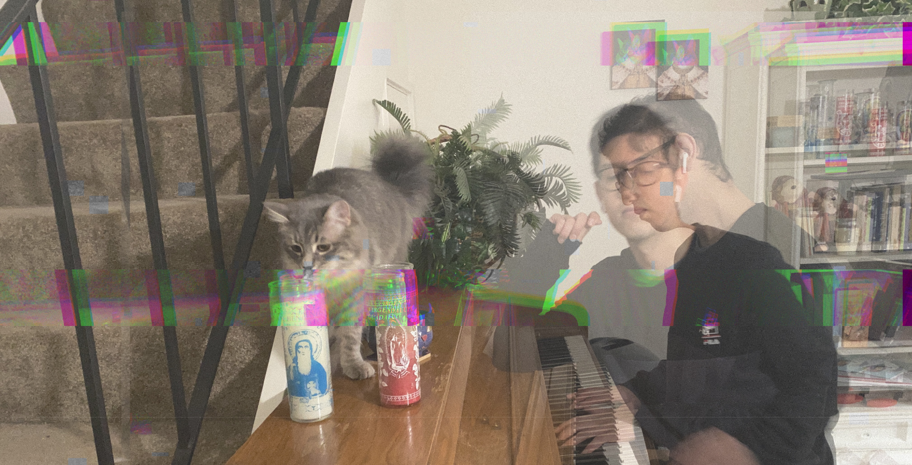

Synthesaurio is an audiovisual project by Pablo Gomez. Pablo is a research epidemiologist by day, by night he likes to experiment with sound and light to create semi generative landscapes reflecting on nature and our relationship as humans with it. Synthesaurio experiments with the umwelt, the subjective way of perceiving the world based on one's experiences. In his project, he experiments with interchanging signals trough different algorithms to intervene the sound design and visual composition process to generate audiovisual reinterpretations of the world. Relying on abstractions, invites the audience to reinterpret his work based on their own personal experiences.

# Who is Pablo?
 
  

Hi I am Pablo Gomez, born in Guanajuato, Mexico. Research epidemiologist by day, audiovisual artist by night; I have been working in health sciences for the last 10 year. Trough my journey I have been fortunate to see the world from many perspectives. From working in farms in the southern border of Mexico, to working surrounded by computers in the basement of a research institution. I am interested in the intersection of science and art and how we can use technology to unravel the beauty of complex systems.  
In my "daytime" job I use techniques in statistics, programming and simulation modeling; in my artistic work I like to explore techniques such as algorithmic composition for both music and visuals. I find my inspiration in the interrelationship of human society with nature, and I like to think that my work serves as bridges between different areas of knowledge.  
I am an advocate of open access frameworks and affordable computing, and I am interested in liberating from the capitalist thinking that you need expensive tools to make good digital art.

You can find my music on all streaming platforms including: Bandcamp, Spotify, YouTube and Apple Music.
